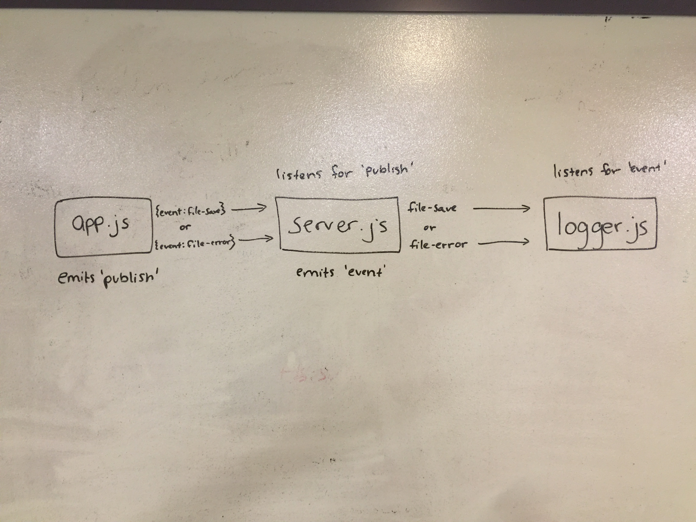

# lab-18-socket-io

# LAB - 18

## Socket.io

### Author: Adrienne Easton

### Links and Resources
* [submission PR](https://github.com/401-advanced-javascript-aeaston/lab-18-socket-io/pull/1)
* [travis]

#### Documentation

### Modules
#### `app.js'

#### 'server.js'

#### 'logger.js'

### Setup
#### `.env` requirements
npm i

#### Running the app
Three terminals:
* nodemon
* node logger.js
* node app.js files/test.txt

#### Tests
npm test

#### UML
